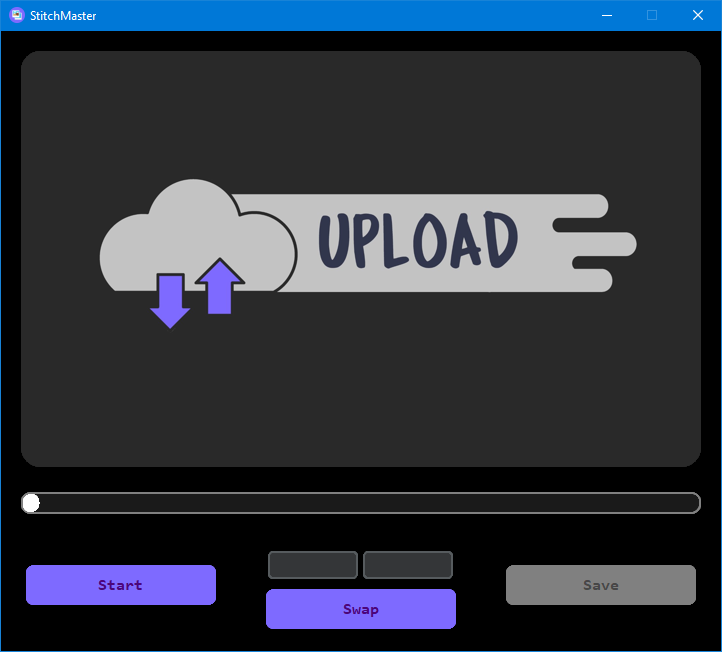
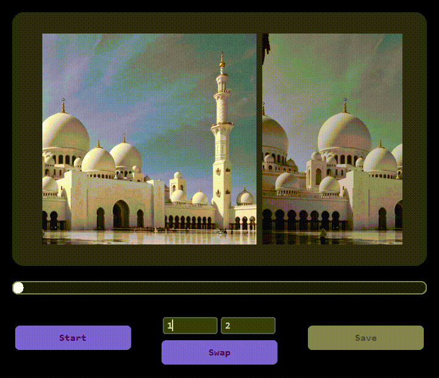

# Fast Panorama Stitching with SIFT

This repository implements an improved algorithm for fast panorama stitching based on the paper ["The Improved Algorithm of Fast Panorama Stitching for Image Sequence and Reducing the Distortion Errors"](https://www.researchgate.net/publication/282435745_The_Improved_Algorithm_of_Fast_Panorama_Stitching_for_Image_Sequence_and_Reducing_the_Distortion_Errors). 

The paper introduces a new faster image stitching algorithm by reducing the unnecessary SIFT detection area in the reference image.
Compared with the traditional method, the improved method proposed in this paper starts stitching from the middle position of the image sequence.

The middle image is taken as the reference image. Then, we obtain the affine matrix for any image in the sequence to the reference image according to the statistics information of all affine transformation matrixes between the adjacent images.

## Notebooks

1. `SIFT_Implementation.ipynb`: SIFT algorithm implementation From-scratch.
2. `RANSAC_Homography_Stitching.ipynb`: RANSAC homography stitching for two images.
3. `Multiple_Image_Stitching.ipynb`: Stitching of multiple images to create a panorama.

## Python Files

- `sift_extractor.py`: SIFT algorithm implementation in a class.
- `panorama_stitching.py`: RANSAC homography stitching and multiple image stitching class for panorama creation.
- `gui.py`: Graphical user interface (GUI) for interaction.

## GUI Usage
1. Upload ordered images using **upload** button.
2. If images are not ordered you can change the order using swap button. 
3. Press start to start stitching images.
4. You can save the image after stitching ends using save button, and the image will be saved in the directory of the application.

    

### Stitching Process:

    

## Limitations

- Limited robustness to changes in lighting conditions.
- It is not guarantee to work well in all cases.

## Dependencies

Ensure you have the required dependencies installed:
- opencv
- numpy
- skimage
- matplotlib
- PIL
- CustomTkinter

## GUI
To run the GUI use the following command in python directory:
`python gui.py`

## Notes
Building exe file using pyinstaller erased `RecursionError: maximum recursion depth exceeded during compilation ` which i couldn't solve.